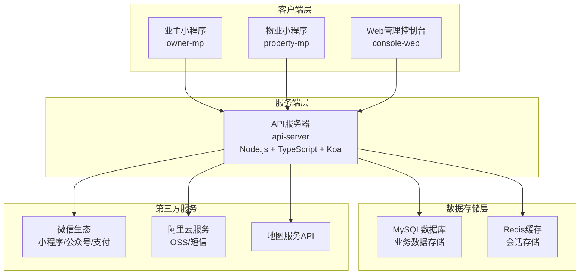
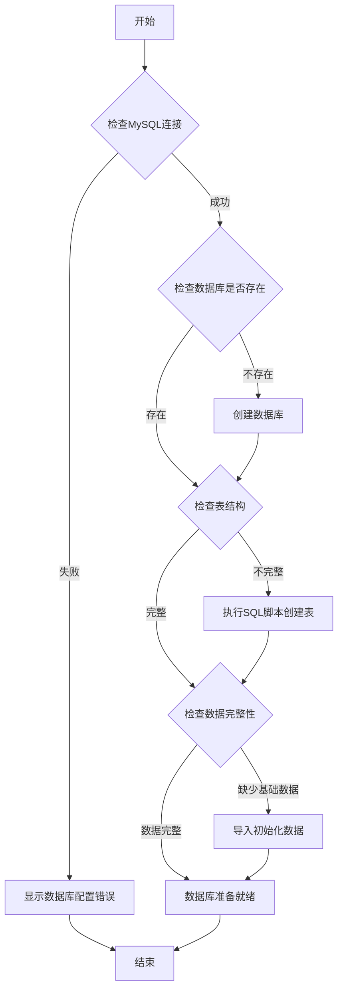
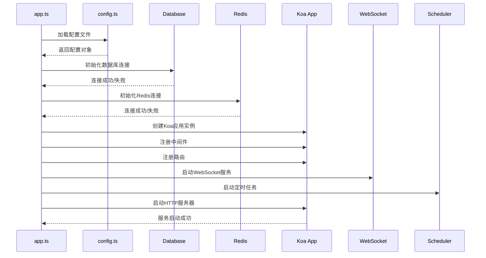
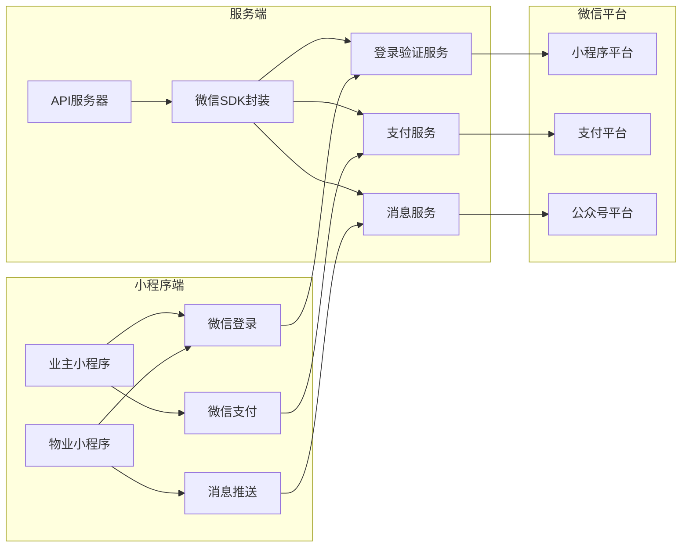
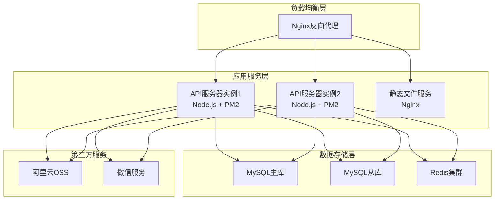

# ejyy-legacy-restore 技术设计方案

## 设计概述

本设计方案基于现有「e家宜业」系统的架构分析，制定系统恢复的技术路线和实施策略。采用分阶段、分模块的恢复方式，确保系统功能逐步恢复并达到稳定可用状态。

## 系统架构分析

### 现有架构概览



### 技术栈详情

| 模块 | 技术栈 | 版本要求 | 状态评估 |
|------|---------|----------|----------|
| api-server | Node.js + TypeScript + Koa | Node.js >=12.1.0 | ⚠️ 需要配置恢复 |
| console-web | Vue.js 2 + view-design | Vue ~2.6.11 | ⚠️ 配置为空 |
| owner-mp | 微信小程序原生 | WeChat SDK 2.16.0 | ⚠️ API配置硬编码 |
| property-mp | 微信小程序原生 | WeChat SDK 最新 | ✅ 相对完整 |

## 恢复策略设计

### 1. 配置管理系统设计

#### 1.1 主配置文件 (.ejyyrc) 结构设计

```yaml
# 系统基础配置
system:
  name: "e家宜业"
  debug: false
  version: "1.1.10"

# 服务器配置  
server:
  port: 3000
  host: "0.0.0.0"

# 数据库配置
mysql:
  host: "localhost"
  port: 3306
  user: "ejyy"
  password: "your_password"
  database: "ejyy"
  charset: "utf8mb4"
  timezone: "+08:00"

# Redis配置
redis:
  host: "localhost"
  port: 6379
  password: ""
  db: 0

# 微信配置
wechat:
  # 业主小程序
  ump:
    appid: "wx_owner_appid"
    secret: "wx_owner_secret"
  # 物业小程序  
  pmp:
    appid: "wx_property_appid"
    secret: "wx_property_secret"
  # 公众号
  oa:
    appid: "wx_oa_appid"
    secret: "wx_oa_secret"
    token: "your_token"
    key: "your_encoding_key"
  # 微信支付
  pay:
    mch_id: "your_mch_id"
    key: "your_pay_key"
    cert_path: "./cert/apiclient_cert.p12"
    notify_url: "https://yourdomain.com/notify/wechat/pay"

# 阿里云服务配置
aliyun:
  access_key_id: "your_access_key_id"
  access_key_secret: "your_access_key_secret"
  # OSS对象存储
  oss:
    bucket: "your_bucket_name"
    region: "oss-cn-hangzhou"
    endpoint: "https://oss-cn-hangzhou.aliyuncs.com"
  # 短信服务
  sms:
    region_id: "cn-hangzhou"
    template_code: "SMS_12345678"
    sign_name: "e家宜业"

# 地图服务配置
map:
  provider: "amap"  # 高德地图
  key: "your_amap_key"

# 邮件服务配置  
smtp:
  host: "smtp.qq.com"
  port: 587
  secure: false
  user: "your_email@qq.com"
  password: "your_email_password"

# 文件上传配置
upload:
  max_file_size: 10485760  # 10MB
  allowed_types: ["jpg", "jpeg", "png", "pdf", "doc", "docx", "xls", "xlsx"]
  storage_path: "./uploads"
```

#### 1.2 前端配置标准化设计

**console-web/src/config.js**:
```javascript
// 根据环境变量或构建参数确定配置
const isDev = process.env.NODE_ENV === 'development';

export const HOST_NAME = isDev 
  ? 'http://localhost:3000' 
  : 'https://api.yourdomain.com';

export const ASSET_HOST = isDev
  ? 'http://localhost:3000'
  : 'https://assets.yourdomain.com';

export const MAP_KEY = process.env.VUE_APP_MAP_KEY || '';

export const TOKEN_ID = 'EJYY_PC_TOKEN';
export const USER_ID = 'EJYY_PC_USER_ID';
export const SITE_TITLE = 'e家宜业';
export const DEGAULT_PAGE_SIZE = 10;
export const FORM_ADAPT_WIDTH = 992;
```

**小程序配置模板**:
```javascript
// 环境配置
const ENV = 'development'; // development | production

const config = {
  development: {
    API_HOST: 'https://dev-api.yourdomain.com',
    ASSETS_HOST: 'https://dev-assets.yourdomain.com'
  },
  production: {
    API_HOST: 'https://api.yourdomain.com',
    ASSETS_HOST: 'https://assets.yourdomain.com'
  }
};

export const API_HOST = config[ENV].API_HOST;
export const ASSETS_HOST = config[ENV].ASSETS_HOST;
export const TOKEN_NAME = 'EJYY-TOKEN';
export const USER_ID = 'USER_ID';
export const WECHAT_VERSION = '7.0.0';
export const SDK_VERSION = '2.16.0';
export const VERSION = '1.1.10';
```

### 2. 数据库恢复策略

#### 2.1 数据库初始化流程



#### 2.2 数据库连接池配置

```typescript
// api-server/src/config.ts 中的数据库配置
export const mysqlConfig: Knex.Config = {
  client: 'mysql2',
  connection: {
    host: config.mysql.host,
    port: config.mysql.port,
    user: config.mysql.user,
    password: config.mysql.password,
    database: config.mysql.database,
    charset: 'utf8mb4',
    timezone: 'Z'
  },
  pool: {
    min: 2,
    max: 10,
    acquireTimeoutMillis: 30000,
    createTimeoutMillis: 30000,
    destroyTimeoutMillis: 5000,
    idleTimeoutMillis: 30000,
    reapIntervalMillis: 1000,
    createRetryIntervalMillis: 200
  },
  acquireConnectionTimeout: 30000,
  migrations: {
    directory: './migrations',
    tableName: 'ejyy_migrations'
  }
};
```

### 3. API服务器恢复设计

#### 3.1 应用启动流程



#### 3.2 中间件注册顺序

```typescript
// 关键中间件的注册顺序
app.use(cors()); // 跨域处理
app.use(koaLogger()); // 请求日志
app.use(bodyParser()); // 请求体解析
app.use(session(sessionConfig, app)); // 会话管理
app.use(modelMiddleware()); // 数据模型注入
app.use(ipMiddleware()); // IP记录
app.use(headerMiddleware()); // 请求头处理
app.use(watcherMiddleware()); // 请求监控
app.use(router.routes()); // 业务路由
app.use(router.allowedMethods()); // HTTP方法支持
```

#### 3.3 错误处理策略

```typescript
// 全局错误处理中间件
app.use(async (ctx: Context, next: Next) => {
  try {
    await next();
  } catch (error) {
    cwlog.error('API Error:', error);
    
    // 数据库错误
    if (error.code && error.code.startsWith('ER_')) {
      ctx.status = 500;
      ctx.body = { code: -1, message: '数据库操作失败' };
      return;
    }
    
    // 微信API错误
    if (error.errcode) {
      ctx.status = 400;
      ctx.body = { code: error.errcode, message: error.errmsg };
      return;
    }
    
    // 业务逻辑错误
    if (error.code && typeof error.code === 'number') {
      ctx.status = 400;
      ctx.body = { code: error.code, message: error.message };
      return;
    }
    
    // 未知错误
    ctx.status = 500;
    ctx.body = { code: -1, message: '系统内部错误' };
  }
});
```

### 4. 前端应用恢复设计

#### 4.1 Vue.js 应用构建配置

```javascript
// vue.config.js
const path = require('path');

module.exports = {
  publicPath: process.env.NODE_ENV === 'production' ? '/console/' : '/',
  outputDir: 'dist',
  assetsDir: 'static',
  lintOnSave: process.env.NODE_ENV === 'development',
  
  devServer: {
    port: 8080,
    host: '0.0.0.0',
    https: false,
    proxy: {
      '/api': {
        target: 'http://localhost:3000',
        changeOrigin: true,
        pathRewrite: {
          '^/api': ''
        }
      }
    }
  },
  
  configureWebpack: {
    resolve: {
      alias: {
        '@': path.resolve(__dirname, 'src')
      }
    }
  },
  
  css: {
    loaderOptions: {
      less: {
        lessOptions: {
          javascriptEnabled: true
        }
      }
    }
  },
  
  chainWebpack: config => {
    // 处理legacy OpenSSL provider问题
    if (process.env.NODE_ENV === 'development') {
      config.optimization.minimizer('terser').tap((args) => {
        args[0].terserOptions.compress.drop_console = false;
        return args;
      });
    }
  }
};
```

#### 4.2 HTTP请求封装

```javascript
// utils/request.js
import axios from 'axios';
import { Message } from 'view-design';
import { HOST_NAME, TOKEN_ID, USER_ID } from '@/config';

// 创建axios实例
const service = axios.create({
  baseURL: HOST_NAME,
  timeout: 30000
});

// 请求拦截器
service.interceptors.request.use(
  config => {
    const token = localStorage.getItem(TOKEN_ID);
    if (token) {
      config.headers['Authorization'] = `Bearer ${token}`;
    }
    return config;
  },
  error => {
    return Promise.reject(error);
  }
);

// 响应拦截器
service.interceptors.response.use(
  response => {
    const res = response.data;
    
    // 业务成功
    if (res.code === 0) {
      return res.data;
    }
    
    // token失效
    if (res.code === -1000) {
      Message.error('登录已过期，请重新登录');
      localStorage.removeItem(TOKEN_ID);
      localStorage.removeItem(USER_ID);
      window.location.href = '/login';
      return Promise.reject(new Error(res.message));
    }
    
    // 其他业务错误
    Message.error(res.message || '请求失败');
    return Promise.reject(new Error(res.message));
  },
  error => {
    Message.error('网络请求失败');
    return Promise.reject(error);
  }
);

export default service;
```

### 5. 小程序应用恢复设计

#### 5.1 小程序请求封装

```javascript
// utils/request.js (小程序版本)
import { API_HOST, TOKEN_NAME } from '../config.js';

class Request {
  constructor() {
    this.baseURL = API_HOST;
    this.timeout = 30000;
  }

  request(options) {
    return new Promise((resolve, reject) => {
      const token = wx.getStorageSync(TOKEN_NAME);
      
      wx.request({
        url: this.baseURL + options.url,
        method: options.method || 'GET',
        data: options.data || {},
        timeout: this.timeout,
        header: {
          'Content-Type': 'application/json',
          ...(token && { 'Authorization': `Bearer ${token}` }),
          ...options.header
        },
        success: (res) => {
          if (res.statusCode === 200) {
            if (res.data.code === 0) {
              resolve(res.data.data);
            } else if (res.data.code === -1000) {
              // token失效
              wx.removeStorageSync(TOKEN_NAME);
              wx.showToast({ title: '请重新登录', icon: 'none' });
              // 跳转到登录页
              wx.reLaunch({ url: '/pages/login/index' });
              reject(new Error(res.data.message));
            } else {
              wx.showToast({ title: res.data.message, icon: 'none' });
              reject(new Error(res.data.message));
            }
          } else {
            wx.showToast({ title: '网络请求失败', icon: 'none' });
            reject(new Error(`HTTP ${res.statusCode}`));
          }
        },
        fail: (err) => {
          wx.showToast({ title: '网络连接失败', icon: 'none' });
          reject(err);
        }
      });
    });
  }

  get(url, data = {}, options = {}) {
    return this.request({ url, method: 'GET', data, ...options });
  }

  post(url, data = {}, options = {}) {
    return this.request({ url, method: 'POST', data, ...options });
  }
}

export default new Request();
```

### 6. 第三方服务集成设计

#### 6.1 微信服务集成架构



#### 6.2 文件上传服务设计

```typescript
// service/upload.ts
import { Context } from 'koa';
import OSS from 'ali-oss';
import path from 'path';
import { v4 as uuidv4 } from 'uuid';

class UploadService {
  private ossClient: OSS;
  
  constructor() {
    this.ossClient = new OSS({
      region: config.aliyun.oss.region,
      accessKeyId: config.aliyun.access_key_id,
      accessKeySecret: config.aliyun.access_key_secret,
      bucket: config.aliyun.oss.bucket
    });
  }

  async uploadFile(ctx: Context) {
    const file = ctx.request.files?.file;
    if (!file) {
      throw new Error('请选择要上传的文件');
    }

    // 验证文件类型和大小
    this.validateFile(file);

    // 生成唯一文件名
    const fileName = this.generateFileName(file.name);
    
    try {
      // 上传到OSS
      const result = await this.ossClient.put(fileName, file.path);
      
      // 返回文件URL
      return {
        url: result.url,
        name: file.name,
        size: file.size,
        key: fileName
      };
    } catch (error) {
      throw new Error('文件上传失败');
    }
  }

  private validateFile(file: any) {
    const maxSize = config.upload.max_file_size;
    const allowedTypes = config.upload.allowed_types;
    
    if (file.size > maxSize) {
      throw new Error('文件大小超过限制');
    }
    
    const ext = path.extname(file.name).toLowerCase().substr(1);
    if (!allowedTypes.includes(ext)) {
      throw new Error('不支持的文件类型');
    }
  }

  private generateFileName(originalName: string): string {
    const ext = path.extname(originalName);
    return `uploads/${Date.now()}/${uuidv4()}${ext}`;
  }
}

export default new UploadService();
```

## 部署架构设计

### 生产环境部署架构



### Docker容器化部署

```dockerfile
# api-server Dockerfile
FROM node:12-alpine

WORKDIR /app

# 复制依赖文件
COPY package*.json ./
RUN npm ci --only=production

# 复制源代码
COPY . .

# 构建项目
RUN npm run dist

# 暴露端口
EXPOSE 3000

# 启动命令
CMD ["node", "dist/app.js"]
```

```yaml
# docker-compose.yml
version: '3.8'

services:
  api:
    build: ./api-server
    ports:
      - "3000:3000"
    environment:
      - NODE_ENV=production
    volumes:
      - ./config/.ejyyrc:/app/.ejyyrc
      - ./logs:/app/logs
    depends_on:
      - mysql
      - redis

  web:
    build: ./console-web  
    ports:
      - "8080:80"
    depends_on:
      - api

  mysql:
    image: mysql:5.7
    environment:
      MYSQL_ROOT_PASSWORD: root123
      MYSQL_DATABASE: ejyy
    volumes:
      - mysql_data:/var/lib/mysql
      - ./resources/db.sql:/docker-entrypoint-initdb.d/init.sql
    ports:
      - "3306:3306"

  redis:
    image: redis:6-alpine
    ports:
      - "6379:6379"

volumes:
  mysql_data:
```

## 监控与日志设计

### 应用监控指标

1. **系统指标**: CPU使用率、内存使用率、磁盘空间
2. **应用指标**: API响应时间、错误率、并发数
3. **业务指标**: 用户活跃度、功能使用情况、支付成功率

### 日志收集策略

```typescript
// utils/logger.ts
import cwlog from 'chowa-log';
import path from 'path';

const logger = cwlog({
  level: config.debug ? 'debug' : 'info',
  file: {
    enable: true,
    filename: path.join(__dirname, '../logs/app.log'),
    maxFiles: 30,
    maxSize: '100M'
  },
  console: {
    enable: config.debug,
    colorize: true
  }
});

export default logger;
```

这个技术设计方案为 `ejyy-legacy-restore` 项目提供了完整的恢复路线图，涵盖了配置管理、数据库恢复、API服务、前端应用、小程序应用等各个方面的技术实现细节。