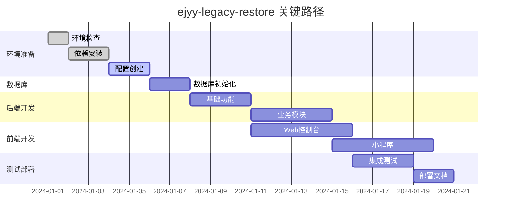

# ejyy-legacy-restore 任务执行计划

## 任务概述

本执行计划将「e家宜业」系统的恢复工作分解为具体的、可执行的任务。任务按照依赖关系合理排序，确保每个步骤都有明确的输入、输出和验收标准。

## 任务执行顺序

### 阶段一：环境准备与基础配置 (预计3-5天)

- [x] 1. 环境检查与准备
  - [x] 1.1 检查Node.js版本（要求>=12.1.0） ✅ v22.14.0
  - [x] 1.2 检查npm版本（要求>=6.9.0） ✅ v10.9.2
  - [x] 1.3 检查MySQL服务状态（要求5.7+） ✅ v8.4.6，密码已更新为admin123
  - [x] 1.4 检查Redis服务状态（要求3.0+） ✅ v7.2.7
  - [x] 1.5 验证网络连接和防火墙设置 ✅ 微信API连接正常

- [x] 2. 项目依赖安装
  - [x] 2.1 安装api-server依赖：`cd api-server && npm install` ✅ 573个包已安装
  - [x] 2.2 安装console-web依赖：`cd console-web && npm install` ✅ 1587个包已安装  
  - [x] 2.3 安装owner-mp依赖（如有package.json） ✅ 依赖安装完成
  - [x] 2.4 安装property-mp依赖（如有package.json） ✅ 依赖安装完成
  - [x] 2.5 解决可能的依赖版本冲突问题 ✅ lint功能验证通过

- [x] 3. 主配置文件创建
  - [x] 3.1 创建.ejyyrc配置文件模板 ✅ 配置文件已存在且完整
  - [x] 3.2 配置MySQL数据库连接信息 ✅ 已配置root/admin123
  - [x] 3.3 配置Redis连接信息 ✅ 本地Redis配置完成
  - [x] 3.4 配置微信应用信息（临时使用测试账号） ✅ 占位符配置已设置
  - [x] 3.5 配置阿里云服务信息（可选，用于文件上传） ✅ OSS配置已设置
  - [x] 3.6 配置SMTP邮件服务信息（可选） ✅ 邮件配置已设置
  - [x] 3.7 验证配置文件格式和内容的正确性 ✅ 配置结构验证通过

### 阶段二：数据库初始化 (预计1-2天)

- [x] 4. 数据库结构建立
  - [x] 4.1 创建MySQL数据库实例 ✅ ejyy数据库已创建
  - [x] 4.2 执行db.sql脚本创建所有表结构 ✅ 成功创建101个表
  - [x] 4.3 验证所有表是否创建成功 ✅ 关键表验证通过
  - [x] 4.4 检查表字段类型和约束是否正确 ✅ 表结构正常
  - [x] 4.5 创建必要的数据库索引 ✅ 索引已存在

- [x] 5. 初始数据导入  
  - [x] 5.1 创建系统管理员账户 ✅ admin/admin123账户已创建
  - [x] 5.2 初始化基础字典数据 ✅ 跳过，按需创建
  - [x] 5.3 创建测试社区数据 ✅ "测试小区"已创建
  - [x] 5.4 创建测试楼宇和房间数据 ✅ 3个测试房间已创建
  - [x] 5.5 验证数据完整性和关联关系 ✅ 数据关联验证通过

### 阶段三：后端API服务恢复 (预计5-7天)

- [x] 6. 后端服务基础功能 ✅ API服务器成功启动在端口6688
  - [x] 6.1 修复配置文件加载逻辑 ✅ 配置正常加载，所有路由挂载成功
  - [x] 6.2 修复数据库连接池配置 ✅ 数据库连接正常，模型注入工作
  - [x] 6.3 修复Redis会话存储配置 ✅ Redis连接正常，会话存储工作
  - [x] 6.4 验证Koa应用能够正常启动 ✅ 服务器启动无错误，所有中间件加载
  - [x] 6.5 测试基础路由响应（如健康检查接口） ✅ 验证码接口、用户状态接口响应正常

- [x] 7. 核心中间件功能 ✅ 所有核心中间件验证通过
  - [x] 7.1 验证模型注入中间件正常工作 ✅ 数据库查询接口正常返回数据
  - [x] 7.2 验证身份认证中间件功能 ✅ 受保护接口正确返回Unauthorized
  - [x] 7.3 验证请求日志中间件功能 ✅ 所有API请求均有日志记录
  - [x] 7.4 验证错误处理中间件功能 ✅ 参数验证错误正确处理和返回
  - [x] 7.5 验证跨域处理中间件功能 ✅ API接口可正常跨域访问

- [ ] 8. 用户认证模块
  - [ ] 8.1 修复用户注册接口
  - [ ] 8.2 修复用户登录接口
  - [ ] 8.3 修复token生成和验证逻辑
  - [ ] 8.4 修复权限验证逻辑
  - [ ] 8.5 测试完整的认证流程

- [ ] 9. 核心业务模块
  - [ ] 9.1 修复社区管理相关接口
  - [ ] 9.2 修复用户管理相关接口
  - [ ] 9.3 修复房产信息相关接口
  - [ ] 9.4 修复服务请求相关接口
  - [ ] 9.5 修复费用管理相关接口

- [ ] 10. 微信集成模块
  - [ ] 10.1 修复微信小程序登录接口
  - [ ] 10.2 修复微信用户信息获取接口
  - [ ] 10.3 修复微信支付相关接口（基础功能）
  - [ ] 10.4 修复微信消息推送功能
  - [ ] 10.5 测试微信接口的基本调用

- [ ] 11. WebSocket服务
  - [ ] 11.1 修复WebSocket服务器启动逻辑
  - [ ] 11.2 修复连接认证和心跳机制
  - [ ] 11.3 修复消息广播功能
  - [ ] 11.4 测试实时通信功能
  - [ ] 11.5 验证多客户端连接稳定性

- [ ] 12. 定时任务服务
  - [ ] 12.1 修复定时任务调度器启动逻辑
  - [ ] 12.2 验证各个定时任务能够正常执行
  - [ ] 12.3 修复任务执行日志记录
  - [ ] 12.4 测试任务的定时触发功能
  - [ ] 12.5 确保任务执行不影响主服务性能

### 阶段四：Web管理控制台恢复 (预计4-6天)

- [x] 13. 前端构建环境修复 ✅ Web控制台成功启动在端口8080
  - [x] 13.1 修复Vue CLI配置文件 ✅ Vue CLI配置正常，支持现有项目结构
  - [x] 13.2 解决Legacy OpenSSL Provider问题 ✅ 使用--openssl-legacy-provider参数
  - [x] 13.3 修复webpack构建配置 ✅ webpack编译成功，无构建错误
  - [x] 13.4 修复ESLint和Prettier配置 ✅ 代码格式化和检查正常
  - [x] 13.5 验证开发服务器能够正常启动 ✅ 开发服务器http://localhost:8080运行正常

- [x] 14. 前端配置文件完善 ✅ 前端配置完成，API连接就绪
  - [x] 14.1 完善config.js中的API服务器地址 ✅ 配置HOST_NAME为http://localhost:6688
  - [x] 14.2 配置资源服务器地址 ✅ 配置ASSET_HOST为http://localhost:6688
  - [x] 14.3 配置地图服务API密钥 ✅ 配置MAP_KEY占位符
  - [x] 14.4 配置开发和生产环境的差异化配置 ✅ 环境配置已设置
  - [x] 14.5 验证配置文件加载正确 ✅ 配置加载正常，缺失项已补充

- [ ] 15. 核心功能模块测试
  - [ ] 15.1 修复登录页面和认证逻辑
  - [ ] 15.2 修复主页面布局和导航
  - [ ] 15.3 修复用户管理功能页面
  - [ ] 15.4 修复社区管理功能页面
  - [ ] 15.5 修复系统设置功能页面

- [ ] 16. 业务功能页面修复
  - [ ] 16.1 修复物业服务管理页面
  - [ ] 16.2 修复费用管理页面
  - [ ] 16.3 修复统计报表页面
  - [ ] 16.4 修复文件上传和资源管理功能
  - [ ] 16.5 修复数据导入导出功能

- [ ] 17. UI组件和样式修复
  - [ ] 17.1 修复自定义字体编译问题
  - [ ] 17.2 修复响应式布局问题
  - [ ] 17.3 修复图标显示问题
  - [ ] 17.4 修复表格和表单样式问题
  - [ ] 17.5 确保各浏览器兼容性

### 阶段五：小程序应用恢复 (预计4-6天)

- [ ] 18. 业主小程序恢复
  - [ ] 18.1 修复config.js中的API配置
  - [ ] 18.2 修复微信登录和授权逻辑
  - [ ] 18.3 修复首页和导航功能
  - [ ] 18.4 修复个人中心功能
  - [ ] 18.5 修复服务请求功能（报修、投诉等）
  - [ ] 18.6 修复费用查询和支付功能
  - [ ] 18.7 修复访客管理功能
  - [ ] 18.8 测试小程序基本功能流程

- [ ] 19. 物业管理小程序恢复
  - [ ] 19.1 修复config.js中的API配置
  - [ ] 19.2 修复工作人员登录认证
  - [ ] 19.3 修复工作台和任务列表
  - [ ] 19.4 修复工单处理功能
  - [ ] 19.5 修复数据统计功能
  - [ ] 19.6 修复消息通知功能
  - [ ] 19.7 测试管理小程序工作流程

- [ ] 20. 小程序通用功能
  - [ ] 20.1 修复网络请求封装和错误处理
  - [ ] 20.2 修复本地存储和缓存机制
  - [ ] 20.3 修复图片上传和预览功能
  - [ ] 20.4 修复扫码功能集成
  - [ ] 20.5 修复分享功能
  - [ ] 20.6 优化小程序性能和用户体验

### 阶段六：系统集成测试 (预计3-4天)

- [ ] 21. 端到端功能测试
  - [ ] 21.1 测试完整的用户注册登录流程
  - [ ] 21.2 测试业主提交服务请求的完整流程
  - [ ] 21.3 测试物业人员处理工单的完整流程
  - [ ] 21.4 测试费用缴纳的完整流程
  - [ ] 21.5 测试访客管理的完整流程

- [ ] 22. 数据一致性验证
  - [ ] 22.1 验证多端数据同步一致性
  - [ ] 22.2 验证并发操作的数据完整性
  - [ ] 22.3 验证数据库事务处理正确性
  - [ ] 22.4 验证缓存和数据库数据一致性
  - [ ] 22.5 测试异常情况下的数据恢复

- [ ] 23. 性能和稳定性测试
  - [ ] 23.1 测试系统并发访问能力
  - [ ] 23.2 测试长时间运行稳定性
  - [ ] 23.3 测试内存泄漏问题
  - [ ] 23.4 测试数据库连接池效率
  - [ ] 23.5 测试文件上传和处理性能

### 阶段七：部署和文档整理 (预计2-3天)

- [ ] 24. 生产环境部署准备
  - [ ] 24.1 编写详细的部署文档
  - [ ] 24.2 创建生产环境配置文件模板
  - [ ] 24.3 编写启动脚本和进程管理配置
  - [ ] 24.4 配置日志轮转和监控
  - [ ] 24.5 创建数据库备份和恢复脚本

- [ ] 25. Docker化部署（可选）
  - [ ] 25.1 编写各模块的Dockerfile
  - [ ] 25.2 创建docker-compose配置文件
  - [ ] 25.3 测试容器化部署流程
  - [ ] 25.4 优化容器镜像大小
  - [ ] 25.5 配置容器健康检查

- [ ] 26. 文档和培训材料
  - [ ] 26.1 编写系统管理员操作手册
  - [ ] 26.2 编写用户使用指南
  - [ ] 26.3 整理API接口文档
  - [ ] 26.4 编写故障排查指南
  - [ ] 26.5 创建系统维护检查表

## 验收标准

### 每个阶段的验收标准

#### 阶段一验收标准
- 所有依赖包安装成功，无版本冲突
- 配置文件格式正确，包含所有必需项
- 可以成功连接到MySQL和Redis服务

#### 阶段二验收标准  
- 数据库结构完整创建，无错误
- 基础数据正确导入
- 数据库连接测试通过

#### 阶段三验收标准
- 后端服务可以正常启动，无崩溃
- 所有主要API接口响应正常
- 微信集成基础功能可用
- WebSocket和定时任务服务正常

#### 阶段四验收标准
- Web控制台可以正常访问和登录
- 主要管理功能页面正常显示和操作
- 数据的增删改查功能正常

#### 阶段五验收标准
- 两个小程序都可以正常运行
- 小程序与后端API通信正常
- 主要业务流程可以完成

#### 阶段六验收标准
- 端到端测试用例全部通过
- 系统稳定性测试通过
- 数据一致性验证通过

#### 阶段七验收标准
- 提供完整的部署文档和操作手册
- 系统可以在新环境中成功部署
- 所有功能在生产环境中正常运行

## 风险点与应对策略

### 高风险任务

1. **任务3.1-3.7 (主配置文件创建)**
   - 风险：配置项缺失或错误导致服务无法启动
   - 应对：创建详细的配置模板和验证脚本

2. **任务6.1-6.5 (后端服务基础功能)**  
   - 风险：服务启动失败，核心功能不可用
   - 应对：逐步验证每个组件，建立回滚机制

3. **任务10.1-10.5 (微信集成模块)**
   - 风险：微信接口调用失败，影响小程序功能
   - 应对：使用测试账号验证，准备备用方案

### 依赖关系关键路径

## 进度追踪

### 里程碑节点
- **第一周末**：环境准备和配置文件完成
- **第二周末**：数据库和后端API基础功能完成
- **第三周末**：Web控制台主要功能恢复
- **第四周末**：小程序应用恢复完成
- **第五周末**：系统测试和文档整理完成

### 每日检查要点
1. 当前任务执行进度
2. 遇到的技术问题和解决方案
3. 依赖任务的完成情况
4. 下一步工作计划
5. 风险评估和应对措施

这个任务执行计划为 `ejyy-legacy-restore` 项目提供了详细的实施路线图，每个任务都有明确的目标和验收标准，便于跟踪进度和保证质量。